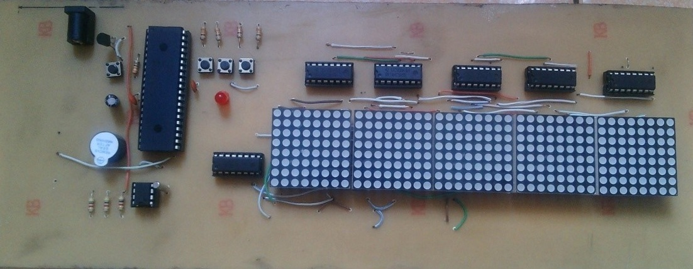

## Recipe
- Temperature sensor `LM35`
- Real-time clock `DS1307`
- Microcontroller `PIC16F887`
- Shift-registers `74HC595`
- LED dot matrix `TOP-CA-1088BS`

|  |
| :----------------------------------------: |
|               Block diagram                |

## Project structure
- [DS1307.c](src/DS1307.c) I2C protocol to communicate with DS1307.
- [HC595.c](src/HC595.c) set/clear LED dot matrix display.
- [main.c](src/main.c) main program use interuption to get real-time clock from DS1307 and display on LED matrix.
- [Schematic](digital-clock.PDF) some of LED dot matrices connection are hidden.

|          |
| :------------------------------------------------: |
|                   Home-made PCB                    |
|  |
|               The circuit is running               |

